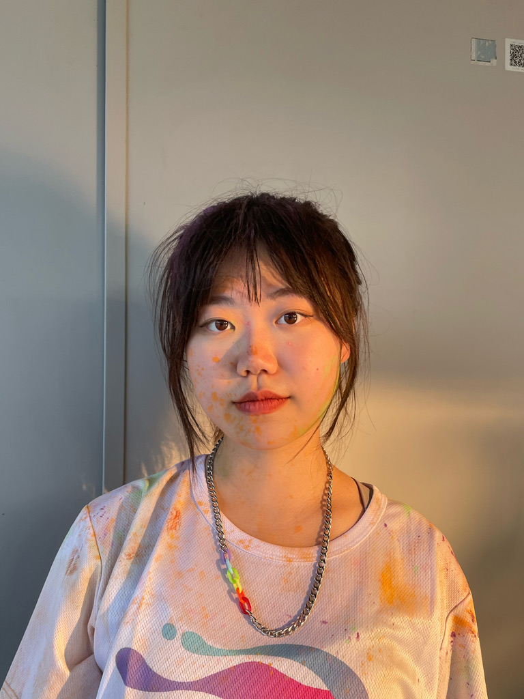

Hi! My name is Jingyi Xu. *Welcome to my website!*

You can find my [email](mailto:<jx2562@cumc.columbia.edu>), [github](http://github.com/xjyes/), and [linkedin](https://www.linkedin.com/in/jingyi-xu-60834624b/) on the upper right conner of this page. Other than that, my resume is presented in the [About](about.html) section. You can always go back to this page by clicking the [Home](index.html) button on the upper left corner. *Nice to meet you!*

 

  

  

  

**Name:** Jingyi Xu

**Gender:** Female

**Education:**
 
      Columbia University (MS in Biostatistics) 
      The Chinese University of Hong Kong, Shenzhen (BS in Bioinformatics)
    

**Hobbies:** Play the basketball, exchange postcards, watch movies
 
  

 

 This website includes my personal information such as my contacts and academic experience. Also, I'm interesed in making friends with shared hobbies.

